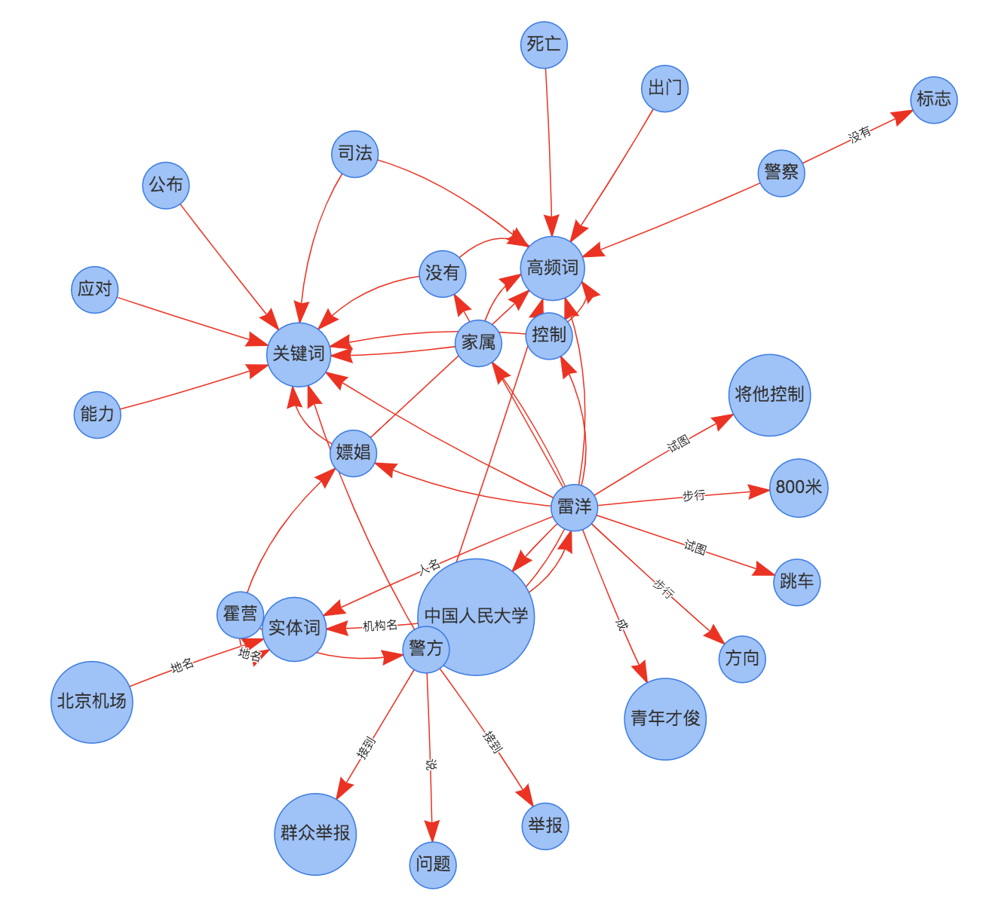
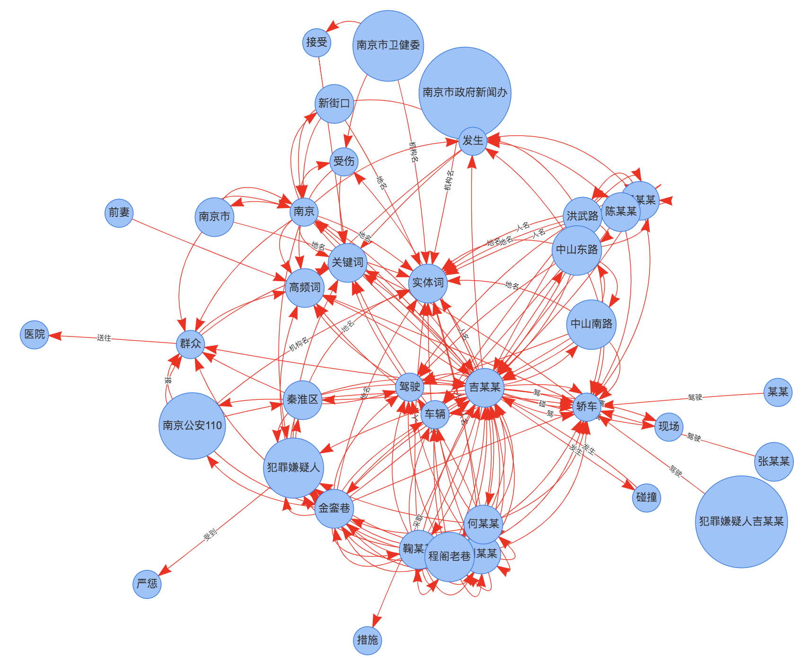

[](https://badge.fury.io/py/relext)
[](CONTRIBUTING.md)
[](LICENSE)


# relext
RelExt: A Tool for Relation Extraction from Text.

文本关系抽取工具。

**Guide**

- [Question](#Question)
- [Solution](#Solution)
- [Feature](#Feature)
- [Install](#install)
- [Usage](#usage)
- [Dataset](#Dataset)
- [Contact](#Contact)
- [Cite](#Cite)
- [Reference](#reference)

# Question

关系抽取咋做？

# Solution


关系抽取结果为三元组（triple），是一种图数据结构，知识图谱的最小单元，表示两个节点及它们之间的关系，即node1，edge，node2。

语言学上，提取句子主干，如"姚明是李秋平的徒弟"主干为（姚明，徒弟，李秋平），形式化表示为（主语，谓语，宾语），也称为SPO（subject，predicate，object）三元组，还有主谓宾（SVO）三元组（姚明，是，徒弟），均是三元组。

不同结构化程度的文本，关系抽取(三元组抽取)方法不一样：

- 结构化文本：映射规则即可转化为三元组，相对简单，业务依赖强。
- 非结构化文本：关系抽取包括两个子任务，实体识别，实体关系分类。三元组抽取模型分为以下两类，
	1. pipeline模型：先基于序列标注模型识别文本的实体，再用分类器识别实体间的关系。优点：各模型单独训练，需要训练样本少，适合冷启动；缺点：模型误差传递。
	2. 联合（joint）模型：实体识别模型和实体关系分类模型整合到一个模型，共享底层特征、二者损失值联合训练。优点：误差传递小，模型推理快；缺点：需要大量训练样本。

# Feature


### 开放域文本关系抽取

- 基于HanLP的dep句法依存分析，抽取主谓宾三元组
- 基于HanLP的ner实体识别，抽取文章实体词
- 基于TextRank图模型抽取文章核心关键词
- 基于文章TF词频抽取高频词


# Install

The project is based on Python 3.6+.
Then, simply do:

```
pip3 install relext
```

or

```
git clone https://github.com/shibing624/relext.git
cd relext
python3 setup.py install
```

# Usage
## 主谓宾三元组抽取

示例[base_demo.py](examples/base_demo.py)

```python
import sys

sys.path.append('..')
from relext import RelationExtract

article = """
咸阳市公安局在解放路街角捣毁一传销窝点，韩立明抓住主犯姚丽丽立下二等功。彩虹分局西区派出所民警全员出动查处有功。
          """

m = RelationExtract()
triples = m.extract_triples(article)
print(triples)
```

output:

```
{
'svo': [['咸阳市公安局', '捣毁', '窝点'], ['韩立明', '抓住', '姚丽丽']],
'keyword': [['传销', '关键词', '关键词'], ['窝点', '关键词', '关键词'], ['韩立明', '关键词', '关键词'], ['捣毁', '关键词', '关键词'], ['抓住', '关键词', '关键词'], ['主犯', '关键词', '关键词'], ['民警', '关键词', '关键词'], ['查处', '关键词', '关键词'], ['出动', '关键词', '关键词'], ['全员', '关键词', '关键词']],
'freq': [['咸阳市公安局', '高频词', '高频词'], ['解放路', '高频词', '高频词'], ['街角', '高频词', '高频词'], ['捣毁', '高频词', '高频词'], ['传销', '高频词', '高频词'], ['窝点', '高频词', '高频词'], ['韩立明', '高频词', '高频词'], ['抓住', '高频词', '高频词'], ['主犯', '高频词', '高频词'], ['姚丽丽', '高频词', '高频词']],
'ner': [['咸阳市公安局', '机构名', '实体词'], ['解放路', '地名', '实体词'], ['韩立明', '人名', '实体词'], ['姚丽丽', '人名', '实体词']],
'coexist': [['解放路', '关联', '咸阳市公安局'], ['咸阳市公安局', '关联', '解放路'], ['姚丽丽', '关联', '韩立明'], ['韩立明', '关联', '姚丽丽']],
'ner_keyword': [['解放路', '关联', '传销'], ['姚丽丽', '关联', '韩立明'], ['咸阳市公安局', '关联', '传销'], ['咸阳市公安局', '关联', '捣毁'], ['韩立明', '关联', '抓住'], ['韩立明', '关联', '主犯'], ['解放路', '关联', '捣毁'], ['解放路', '关联', '窝点'], ['姚丽丽', '关联', '抓住'], ['咸阳市公安局', '关联', '窝点'], ['姚丽丽', '关联', '主犯']]
}
```

### 示例效果

1. 雷洋嫖娼事件


2. 南京胖哥事件


# Contact

- 邮件我：xuming: xuming624@qq.com.
- 微信我：
加我*微信号：xuming624, 备注：个人名称-NLP* 进NLP交流群。


# Cite

如果你在研究中使用了relext，请按如下格式引用：

```latex
@software{relext,
  author = {Xu Ming},
  title = {relext: A Tool for Relation Extraction from Text},
  year = {2021},
  url = {https://github.com/shibing624/relext},
}
```

# License


授权协议为 [The Apache License 2.0](/LICENSE)，可免费用做商业用途。请在产品说明中附加relext的链接和授权协议。


# Contribute
项目代码还很粗糙，如果大家对代码有所改进，欢迎提交回本项目，在提交之前，注意以下两点：

 - 在`tests`添加相应的单元测试
 - 使用`python setup.py test`来运行所有单元测试，确保所有单测都是通过的

之后即可提交PR。


# Reference

- [TextGrapher](https://github.com/liuhuanyong/TextGrapher)
